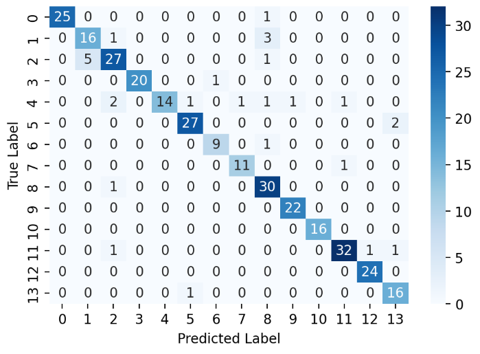

# Model Training and Evaluation

## Training Process

- **Naive Bayes**
  - Training Naive Bayes...

- **Logistic Regression**
  - Training Logistic Regression...

- **Random Forest**
  - Training Random Forest...

- **Support Vector Machine**
  - Training Support Vector Machine...

## Model Comparison

| Model                | Best Parameters                                                                                                     | CV F1 Macro |
|----------------------|---------------------------------------------------------------------------------------------------------------------|-------------|
| Naive Bayes          | `{'alpha': 0.1}`                                                                                                   | 0.9029      |
| Logistic Regression  | `{'C': 1, 'penalty': 'l2'}`                                                                                        | 0.9527      |
| Random Forest        | `{'bootstrap': True, 'max_depth': None, 'max_features': 'sqrt', 'min_samples_leaf': 1, 'min_samples_split': 2, 'n_estimators': 400}` | 0.9619      |
| Support Vector Machine | `{'C': 10, 'kernel': 'rbf'}`                                                                                     | 0.9581      |

**Best Model:** Random Forest (CV F1 = 0.9619)

---

## Best Model Evaluation

### Selected Model: Random Forest
- **CV F1 Macro:** 0.9619

### Test Metrics
- **Test Accuracy:** 0.9211
- **Test F1 Score (Weighted):** 0.9202

### Classification Report

```
              precision    recall  f1-score   support

           0       1.00      0.96      0.98        26
           1       0.82      0.90      0.86        20
           2       0.85      0.85      0.85        33
           3       1.00      0.95      0.98        21
           4       1.00      0.67      0.80        21
           5       0.93      0.93      0.93        29
           6       0.90      0.90      0.90        10
           7       0.92      0.92      0.92        12
           8       0.86      0.97      0.91        31
           9       0.96      1.00      0.98        22
          10       1.00      1.00      1.00        16
          11       0.94      0.91      0.93        35
          12       0.96      1.00      0.98        24
          13       0.84      0.94      0.89        17

    accuracy                           0.92       317
   macro avg       0.93      0.92      0.92       317
weighted avg       0.93      0.92      0.92       317
```

### Confusion Matrix



---

## Summary
Training complete. The best model is **Random Forest** with a CV F1 score of **0.9619**.

---

## Git Commands to Save and Merge

Run the following commands to save and merge the updated README:

```bash
git add README.md
git commit -m "Updated README with training results and evaluation metrics"
git push origin main
git merge main
```
