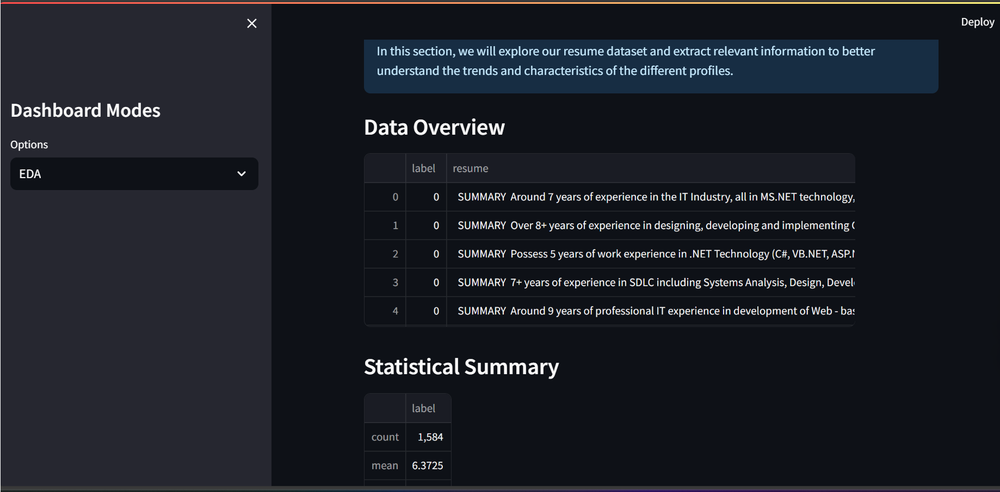
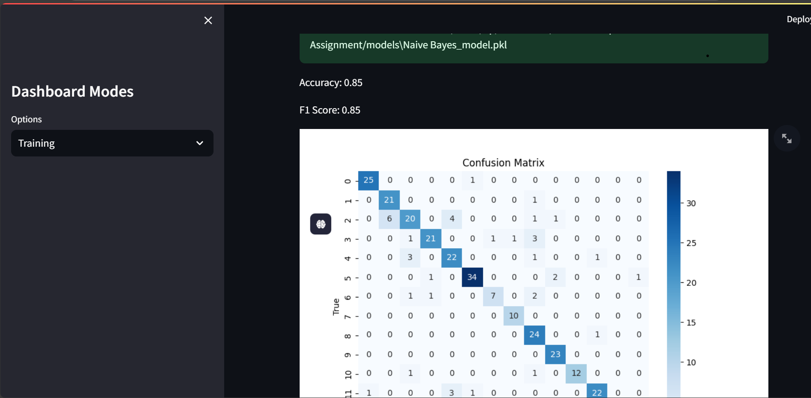
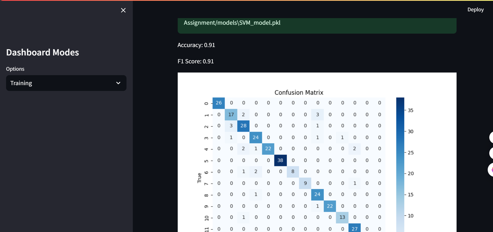
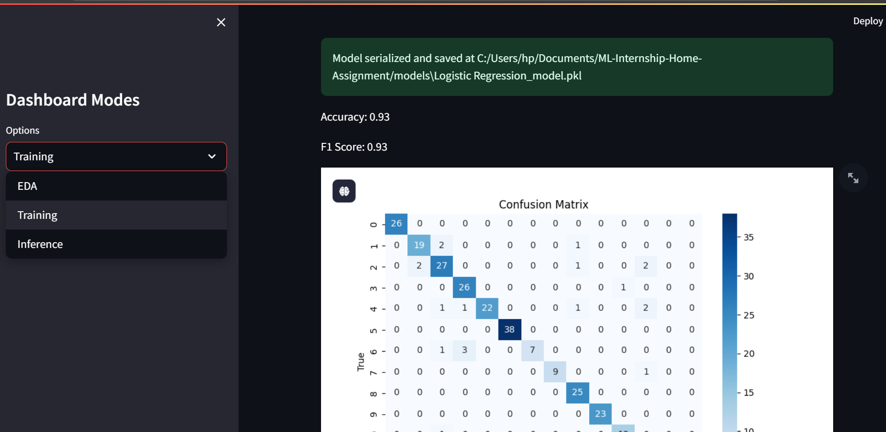
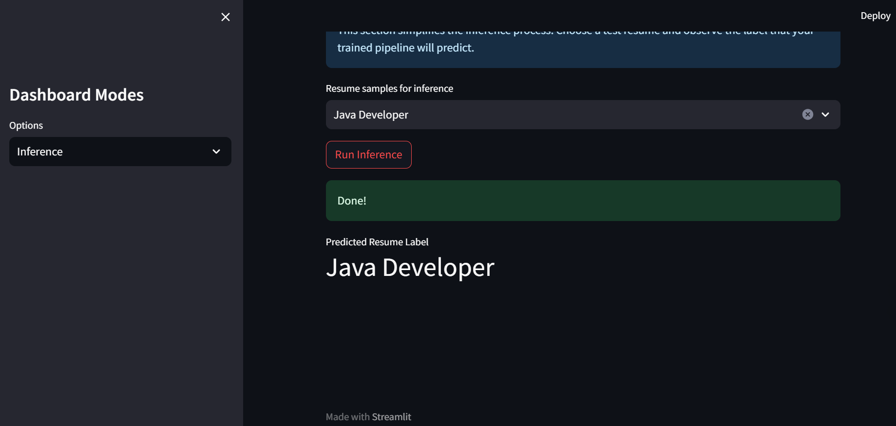

# ML-Internship-Home-Assignment

## Description
This project aims to classify resumes into different categories using machine learning models. The project is divided into three main sections: **Exploratory Data Analysis (EDA)**, **Model Training**, and **Inference**.

## Exploratory Data Analysis (EDA)
In the EDA section of the Streamlit dashboard, I have added the following visualizations and analyses:

1. **Data Overview**: A high-level summary of the dataset, including the number of resumes, labels, and missing values.
2. **Most Frequent Keywords in the Resumes**: A word cloud and bar chart showing the most common keywords in the resumes.
3. **Distribution of Resume Lengths**: A histogram showing the distribution of resume lengths (in terms of word count).
4. **Label Distribution**: A bar chart showing the distribution of labels across the dataset.
5. **Statistical Summary**: A table summarizing key statistics such as mean, median, and standard deviation for resume lengths and label frequencies.

## Training
In the training section, I experimented with three different models to improve upon the baseline Naive Bayes pipeline:

1. **Naive Bayes**: The baseline model, which achieved an accuracy of 0.85.
2. **Support Vector Machine (SVM)**: Achieved an accuracy of 0.91.
3. **Logistic Regression**: Achieved the highest accuracy of 0.93.

Below are the accuracy results for each model:

- **Naive Bayes Accuracy**:
  

- **SVM Accuracy**:
  

- **Logistic Regression Accuracy**:
  

The Logistic Regression model performed the best, with an accuracy of 0.93.

## Inference
In the inference section, I used the **SVM model** to make predictions on new resumes. The results of the predictions are saved to a SQLite database, and the contents of the database are displayed after each inference run.

*Written by ABGHOUNI AMAL*

