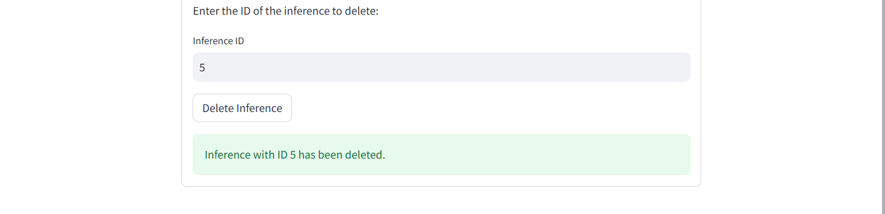
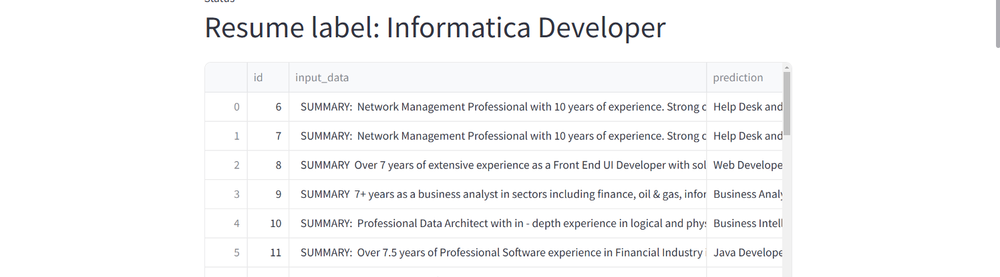

# ML-Internship-Home-Assignment

## Requirements
- Python 3.9 or higher.

#### Create new environment
- `py -3.11 -m venv projectenv`  
*(Use a Python version less than 3.12 to avoid issues with package installation, such as "numpy=1.24.3.")*
#### Install Poetry on your global Python setup
-  `pip install poetry`


#### Install Poetry on the project 
 - `poetry install`

#### Activate the Virtual Environment
- In this example, I run the commands from **Git Bash**:
  - Navigate to the folder path:  
    `cd "/c/Users/yanou/OneDrive/Bureau/ML-Internship-Home-Assignment-main/ML-Internship-Home-Assignment-main"`
  - Activate the virtual environment:  
    `source projectenv/Scripts/activate`

#### Install wordcloud  package
- `pip install wordcloud`

#### Install pytest  package
- `pip install pytest`
  
#### Install sqlalchemy  package
- `pip install sqlalchemy`

#### Install nltk  package
- `pip install nltk`
#### - Start the application
```sh
    sh run.sh
```
- API : http://localhost:8000
- Streamlit Dashboard : http://localhost:9000


# Assignment 
## Assignment Process


## Overview
This project involves refactoring and optimizing an existing unstructured and unmaintainable Python dashboard codebase. In addition to enhancing readability, maintainability, and scalability by reorganizing the structure into logical components and creating reusable utilities, the project introduces several key improvements:
- Integration of a trained logistic regression model with the GridSearch algorithm to improve prediction accuracy.
- Capabilities for adding, displaying, and deleting inference results from the database.
- An interactive Exploratory Data Analysis (EDA) component to enhance data visualization and insights.

---

## Features and Enhancements

### **1. Modular Dashboard Architecture**
- **Objective**: Break down the single long Python file into smaller, manageable components.
- **Solution**:
  - Create a `Component` folder to organize all components used in `dashboard.py`.
  - Include the following files in the `Component` folder:
    - `base_component.py`: Serves as an abstraction or blueprint for components in the application.
    - `component_manager.py`: Enables easy addition or removal of dashboard components.
    - `eda_component.py`: Dedicated to Exploratory Data Analysis (EDA) functionality.
    - `inference_component.py`: Handles inference-related functionalities.
    - `training_component.py`: Contains the training pipeline logic.

### **2. Helper Functions for EDA**
- **Objective**: Simplify the Exploratory Data Analysis component by decoupling utility functions.
- **Solution**:
  - Create a `helperfunction` folder to store reusable EDA functions:
    - `dataset_advanced_analysis.py`
    - `dataset_distribution.py`
    - `dataset_overview.py`
    - `dataset_preprocessing.py`
    - `dataset_wordscloud.py`
  - Avoid a bloated Python file by modularizing these functionalities.

### **3. Utility Functions**
- **Objective**: Centralize common functions for reuse across components.
- **Solution**:
  - Create a `utils` folder in the root directory (`ML-Internship-Home-Assignment`).
  - Add a `helpers.py` file to include functions such as:
    - `display_metrics()`
    - `load_sample_text()`
    - `run_inference()`
    - `save_inference()`
    - `delete_inference()`
  - Reuse these functions in both `inference_component.py` and `training_component.py`.

### **4. Updating the Training Pipeline**
- **Objective**: Enhance model performance and streamline code.
- **Solution**:
  - Replace `NaiveBayesModel` with a new logistic regression model pipeline:
    - Use `TfidfVectorizer` and `GridSearchCV` for optimized predictions.
  - Fix `render_confusion_matrix()` to display the confusion matrix for predicted results.
  - Remove the `if __name__ == "__main__"` block as it is unnecessary.

### **5. Logistic Model for Inference**
- **Objective**: Simplify the inference process by introducing a new logistic regression model.
- **Solution**:
  - Create a `logistic_model.py` file for making predictions in `inference_route.py`.

### **6. Database Integration**
- **Objective**: Centralize and optimize database interactions.
- **Solution**:
  - Create a `database.py` file to:
    - Establish a connection to the database.
    - Automatically create necessary tables if they do not exist.
    - Provide functions for saving and retrieving data efficiently.
  - Ensure seamless and reliable data handling.

### **7. Updating Inference Route**
- **Objective**: Migrate from `NaiveBayesModel` to logistic regression.
- **Solution**:
  - Replace `NaiveBayesModel` with the logistic regression model.
  - Update `PIPELINE_PATH` to reflect the logistic model pipeline.
  - Add endpoints for:
    - Saving results to the database.
    - Retrieving information from the database.
    - Deleting information from the database based on the ID.

---

## Project Structure
```plaintext
ML-Internship-Home-Assignment/
├── Component/
│   ├── __pycache__
│   ├── base_component.py
│   ├── component_manager.py
│   ├── eda_component.py
│   ├── inference_component.py
│   ├── training_component.py
│   ├── helperfunction/
│        ├── dataset_advanced_analysis.py
│        ├── dataset_distribution.py
│        ├── dataset_overview.py
│        ├── dataset_preprocessing.py
│        ├── dataset_wordscloud.py
├── data/
│   ├── processed
│   ├── raw
│        ├── resume.csv
├── data_ml_assignment/
│   ├── api
│        ├── constants.py
│        ├── database.py
│        ├── inference_route.py
│        ├── main.py
│        ├── schemas.py
│        ├── server.py
│   ├── models
│        ├── __init__.py
│        ├── __pycache__
│        ├── base_model.py
│        ├── estimator_interface.py
│        ├── logistic_model.py
│        ├── naive_bayes_model.py
│        ├── svc_model.py
│        ├── xgbc_model.py
│   ├── training
│        ├── __init__.py
│        ├── __pycache__
│        ├── train_pipeline.py
│        ├── logistic_model.py
│   ├── utils
│        ├── __init__.py
│        ├── __pycache__
│        ├── plot_utils.py
│   ├── __init__.py
│   ├── constants.py
├── reports/
├── samples/
├── static/
├── tests/
│     ├── __init__.py
│     ├── __pycache__
│     ├── test_eda.py
│     ├── test_inference.py
│     ├── test_train.py
├── utils/
│   ├── __pycache__
│   ├── __init__.py
│   ├── helpers.py
├── __init__.py
├── api_pid.txt
├── api.log
├── dashboard.py
├── poetry.lock
├── predictions.db
├── pyproject.toml
├── README.md
├── run.sh
├── streamlit_pid.txt
├── streamlit.log
```
---


## Application Interface 

### 1 - Exploratory Data Analysis


##


##


##


##


##

##

##

##


### 2 - Training 

#### Image 1 :
###### The user clicks the Train button and waits until the model finishes training.

##

#### Image 2 :
###### After the model finishes training, the results are displayed on the page along with a confusion matrix.

##

### 3 - Inference


##

- Case 1: If the user selects a resume sample that does not exist.

##

- Case 2: If the user selects a resume sample that exists.

#### Image 1 :

##

#### Image 2 :

##

- Case 3:  If the user wants to delete an inference based on its ID.

#### Image 3 :  
###### The user wants to delete the inference with ID 5.

##

#### Image 4 : 
###### The user goes to the form, enters the value 5, and then deletes the inference.

##

#### Image 5 : 
###### After reloading the page, the inference with an ID value of 5 has been removed and no longer appears in the list.

##


Feel free to reach out for questions or feedback:
- **Email:**  [anouzlay@gmail.com](mailto:anouzlay@gmail.com)
- **GitHub:** [Anouzlay](https://github.com/Anouzlay)


